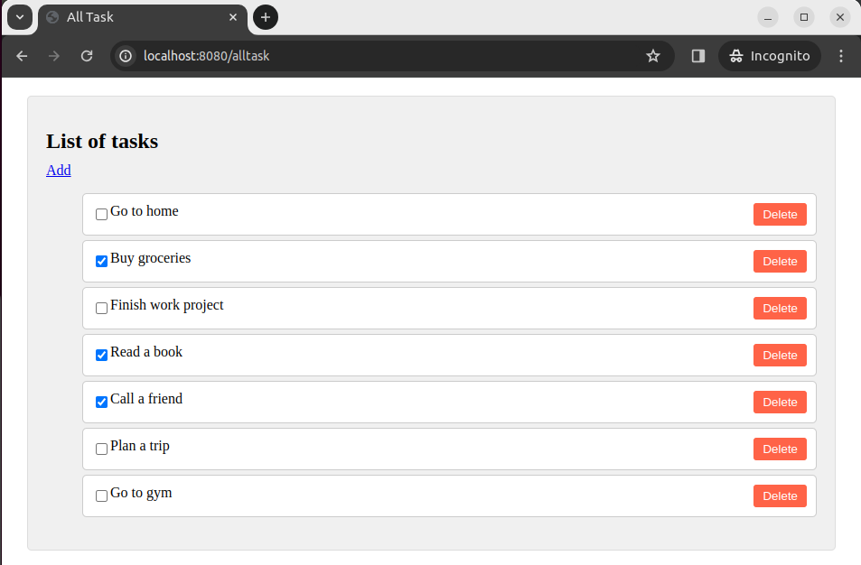

# To-Do List Application

## Features

- Add tasks with a user-friendly UI.
- View all tasks through both the UI and the H2 console in the browser.

## Screenshots





## Getting Started

1. Clone the repository:

    ```bash
    git clone <repository-url>
    ```

2. Navigate to the project directory:

    ```bash
    cd to-do-list
    ```

3. Rename the file `application.properties.example` to `application.properties`:

    ```bash
    mv src/main/resources/application.properties.example src/main/resources/application.properties.example
    ```

4. Open the `application.properties` file:

    ```bash
    nano src/main/resources/application.properties.example
    ```

5. Replace the placeholders with your actual database username and password:

    ```properties
    spring.datasource.username=YOUR_USERNAME
    spring.datasource.password=YOUR_PASSWORD
    ```

   Save and exit the editor.

6. Now, build and run the application:

    ```bash
    mvn spring-boot:run
    ```

7. Open a web browser and go to [http://localhost:8080](http://localhost:8080) to access the application.

8. Go to [My Docker Hub](https://hub.docker.com/repository/docker/leonid06/todolist/general) and pull these images (deprecated version).

9. You can see the result [here](https://drive.google.com/file/d/1DGj1K03JFNI02mNH42vvOi3NLti_4zk-/view?usp=sharing).


## Contributing

Feel free to contribute to the project by opening issues or creating pull requests.


